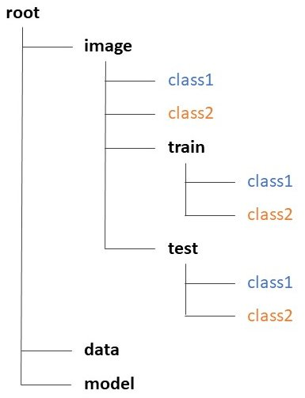

This repository contains the source code used in our paper: Nagao et al., 2020, Molecular Biology of the Cell (accepted; information to be updated). The code is provided as JupyterLab script files (.ipynb).
Before running the scripts, prepare directories as follows.

Then, run the scripts in the following order.

**1. CropImage**  
      With this script, nuclei (blue channel) are detected by Otsu thresholding and images are cropped by centering the nuclei. Before cropping, the entire image is standardized and converted into an 8-bit image. The cropped images then need to be sorted and transfered manually into “root/image/class” folders.

**2. ImageToArray**  
This script converts the cropped images into NumPy arrays, splits the dataset into train and test data, and saves them in “root/image/train/class” or “root/image/test/class” folders. Training data are augmented as well.

**3. BayesianOptimization**  
With this script, hyper parameters are searched in the designated range by Bayesian Optimization. The results can be exported as a CSV file.

**4. FunctionalModel**  
This script performs learning to construct a functional CNN model with a given hyper parameter set. The results including the model architecture and learning curve can be saved.
  
The image data and tuned models used in the paper are available from our Zenodo repository (https://doi.org/10.5281/zenodo.3745864). Annotated and split image data are provided as sets of four NumPy array files converted by above script 2. These sets can be immediately loaded by above scripts 3 and 4. The files for the tuned models were named accordingly to those appeared in the paper (e.g., Model N1).
